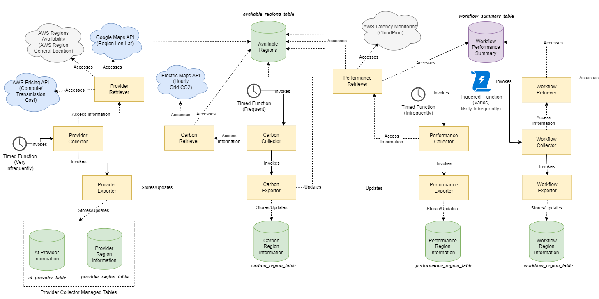

# Design Document

In this document we will discuss the design decisions that have been made for the project.

## Table of Contents

1. [Dataflow DAG Model](#dataflow-dag-model)
   1. [Physical Representation](#physical-representation)
   2. [Logical Representation](#logical-representation)
      1. [Logical Node Naming Scheme](#logical-node-naming-scheme)
      2. [Connection to Physical Representation](#connection-to-physical-representation)
   3. [Discussion](#discussion)
2. [Source Code Annotation](#source-code-annotation)
3. [Synchronization Node](#synchronization-node)
    1. [Implementation](#implementation)
4. [Workflow Placement Decision](#workflow-placement-decision)
    1. [Component Interaction Order](#component-interaction-order)
5. [Data Collectors](#data-collectors)
    1. [Provider Collector](#provider-collector)
    2. [Carbon Collector](#carbon-collector)
    3. [Performance Collector](#performance-collector)
    4. [Workflow Collector](#workflow-collector)
6. [Solvers](#solvers)
    1. [Coarse Grained](#coarse-grained)
    2. [Stochastic Heuristic Descent](#stochastic-heuristic-descent)
    3. [Brute Force](#brute-force)
7. [References](#references)

## Dataflow DAG Model

Each workflow has two representations in our model.
We distinguish between the physical and the logical representation of a workflow.
Following we will quickly go over these two representations and discuss why we chose this representation.

### Physical Representation

The physical representation is the actually deployed functions.
Physical in this sense referes to actual source code being deployed at a cloud provider.
This is the representation that the deployment utilities work with because the only thing which matters for them is which function source code is deployed in what region and at which provider.
The physical representation consists of a set of nodes with no edges:

$P_f = \{n_1, n_2, ..., n_n\}$

This representation is quite simple in our case as the source code for each function is the same, the full workflow folder, however, the handler name (the function name within the package) is different.

### Logical Representation

Our logical representation is, similar to a dataflow DAG [1], the representation of the data flow between the physical instances of our functions.
The dataflow DAG in our case represents calls from functions to other functions with specific input data (thus the name dataflow).
Thus the nodes represent functions or _computations_ and the edges represent data movement between the functions.

The logical representation consists of a set of nodes and a set of edges, where the nodes are of three different types:

- Initial node: The initial node is the node that is called by the user.
It has no incoming edges.
- Intermediate node: An intermediate node is a node that is called by another node.
It has exactly one incoming edge.
- Synchronization node: A synchronization node is a node that is called by multiple other nodes.
It has one or more incoming edges.

The types of nodes are known at deployment time from static code analysis and are not changed during the execution of the workflow.
Likweise, the edges are known at deployment time and are not changed during the execution of the workflow.
A node is represented by a call from one function to another by the corresponding workflow annotation.
See also the section on [Source Code Annotation](#source-code-annotation).
The logical representation is a directed acyclic graph (DAG) with nodes and edges:

$L_f = (N, E)$

where $N$ is the set of nodes and $E$ is the set of edges.

#### Logical Node Naming Scheme

The naming scheme of the nodes is as follows:

- Initial node: `<function_name>:entry_point:0`
- Intermediate node: `<function_name>:<predecessor_function_name>_<predecessor_index>_<successor_of_predecessor_index>:<index_in_dag>`
  Where `<predecessor_function_name>` is the name of the predecessor function, `<predecessor_index>` is the index of the predecessor function in the dag, `<successor_of_predecessor_index>` is the index of the successor of the predecessor function (when a function calls multiple times the same function, this index is used to distinguish between the different calls), and `<index_in_dag>` is the index of the node in the dag in a topological order of dataflow.
- Synchronization node: `<function_name>:sync:<index_in_dag>`

This naming scheme is used to uniquely identify a node in the logical representation.
The scheme has the implication that colons cannot be allowed in the function names.

#### Connection to Physical Representation

The logical representation is connected to the physical representation by the following rules:

- Each node in the logical representation is represented by a physical node, however, the same physical node might be present multiple times in the logical representation.

Thus we also speak of a _pyhsical node_ and its _logical instances_.

There are two exceptions with regards to physical nodes in the logical representation:

- The initial node is present only once in the logical representation.
- A synchronization node is present only once in the logical representation.

### Discussion

These representations gave been chosen because they are simple and easy to understand.
The logical representation is a DAG, which is a well known data structure and easy to work with.
The representation of a DAG was chosen because it opens the avenues for graph optimizations in the solver.
We ended up choosing a graph instead of a multigraph because we do not need to represent multiple edges between two nodes.
The dataflow between the functions is furthermore directed and acyclic because we do not allow for loops in the workflow.

The physical representation is a set of nodes because we do not need to represent any edges between the nodes.
The physical representation is furthermore a set because we do not need to represent the same node multiple times.
This notation is only used for the deployment utilities and is hidden from the solver.

## Source Code Annotation

In an initial version of the project we used a JSON config based approach towards transmitting the workflow information to the deployment utilities.
However, this approach decoupled the workflow from the source code and thus made it hard to reason about the workflow.
Furthermore, it made the static code analysis more complicated as we had to parse the JSON config file and match the functions to the config file.
Thus we decided to use source code annotations instead.
The source code annotations are used to annotate the functions that are part of the workflow.

The source code annotations allow us to easily reason about the workflow and to extract both the physical and the logical representation of the workflow.
There is still an additional configuration file that is used to transmit information such as environment variables and the name of the workflow to the deployment utilities.
However, this information is decoupled from the source code and thus does not affect the static code analysis.

Currently, we support the following annotations:

- At the beginning of the workflow the user has to register the workflow with the following annotation:

```python
workflow = MultiXServerlessWorkflow("workflow_name")
```

- At the beginning of each function the user has to register the function with the following annotation:

```python
@workflow.serverless_function(
    name="First-Function",
    entry_point=True,
    regions_and_providers={
        "allowed_regions": [
          {
            "provider": "aws",
            "region": "us-east-1",
          }
        ],
        "disallowed_regions": None,
        "providers": {
            "aws": {
                "config": {
                    "timeout": 60,
                    "memory": 128,
                },
            },
        },
    },
    environment_variables=[
        {
            "key": "example_key",
            "value": "example_value"
        }
    ],
)
```

The meaning of the different parameters is as follows:

- `name`: The name of the function.
This is the name that is used directly in the physical representation of the workflow and is also used to identify the function in the logical representation of the workflow (see also the section on [Logical Node Naming Scheme](#logical-node-naming-scheme)).
- `entry_point`: A boolean flag that indicates whether the function is the entry point of the workflow.
There can only be one entry point in a workflow.
- `regions_and_providers`: A dictionary that contains the regions and providers that the function can be deployed to.
This can be used to override the global settings in the `config.yml`.
If none or an empty dictionary is provided, the global config takes precedence.
The dictionary has two keys:
  - `allowed_regions`: A list of regions that the function can be deployed to.
  If this list is empty, the function can be deployed to any region.
  - `disallowed_regions`: A list of regions that the function cannot be deployed to.
  If this list is empty, the function can be deployed to any region.
  - `providers`: A list of providers that the function can be deployed to.
  This can be used to override the global settings in the `config.yml`.
  If a list of providers is specified at the function level this takes precedence over the global configurations.
  If none or an empty list is provided, the global config takes precedence.
  Each provider is a dictionary with two keys:
    - `name`: The name of the provider.
    - `config`: A dictionary that contains the configuration for the specific provider.
- `environment_variables`: This parameter represents a list of dictionaries, each designed for setting environment variables specifically for a function. Users must adhere to a structured format within each dictionary. This format requires two entries: "key" and "value". The "key" entry should contain the name of the environment variable, serving as an identifier. The "value" entry holds the corresponding value assigned to that variable.

- Within a function, a user can register a call to another function with the following annotation:

```python
workflow.invoke_serverless_function(second_function, payload)
```

The payload is a dictionary that contains the input data for the function.
The payload is optional and can be omitted if the function does not require any input data.

- Additionally, there is the option of conditionally calling a function.
This is done with the following annotation:

```python
workflow.invoke_serverless_function(second_function, payload, condition)
```

The condition is a boolean expression that is evaluated at runtime.
If the condition evaluates to true, the function is called, otherwise it is not called.

- Finally, there is the option of synchronizing multiple predecessor calls at a synchronization node.
The responses from the predecessor calls are then passed to the synchronization node as a list of responses.
This is done with the following annotation:

```python
responses: list[Any] = workflow.get_predecessor_data()
```

Using this annotation within a function has an important implication with regards to when the entire function is being executed.
The entire function is only executed once all predecessor calls have been completed and the data has been synchronized.
This is important to keep in mind when designing the workflow.
Any code within the function preceding the annotation is also executed only once all predecessor calls have been completed and the data has been synchronized.

## Synchronization Node

The synchronization nodes have a special semantic.
The definition of a synchronization node is that, compared to all other nodes, there are one or more predecessor nodes that call the synchronization node.
The synchronization node will receive the payload (responses) from all predecessor nodes and can then handle the responses according to the user defined logic.
This logic has an important implication for the logical representation of the DAG as it means that since the physical representation does not define on what specific predecessors we are waiting on the synchronization node waits for all predecessors and thus there can only be one logical instance of a synchronization node in the logical representation.
Hence also the slightly different naming scheme of the synchronization nodes (see also the section on [Logical Node Naming Scheme](#logical-node-naming-scheme)).

### Implementation

The logic of the synchronization node is implemented as follows:

1. When a predecessor calls a synchronization node, the predecessor will add its response to a list of responses in a distributed key-value store in the region of the synchronization node.
2. The predecessor will then atomically add its name to the list of predecessors that have called the synchronization node.
3. The new length of the list is then checked against the number of predecessors of the synchronization node.
4. If the counter is equal to the number of predecessors, the synchronization node will be called. Otherwise, the predecessor will not call the synchronization node.
This ensures that the synchronization node is only called when all predecessors have called the synchronization node.

A special consideration is made with regards to conditional calls to successors.
If a conditional call results in the predecessor not calling a successor, the predecessor knows whether any successor of the function not called would have called the synchronization node.
If this is the case, the predecessor will add the name of the corresponding successor to the list of predecessors that have called the synchronization node.
This ensures that the synchronization node is called even if some of the predecessors do not call the synchronization node due to conditional calls.

As previously mentioned, the code in the synchronization node is only executed once all predecessors have written their responses to the distributed key-value store and the counter has been incremented to the number of predecessors, i.e., the synchronization node is only called once all predecessors have called the synchronization node.

## Workflow Placement Decision

The workflow placement decision is a dictionary of information with regards to current function instance placement.
This information is used both to determine the current function instance, as well as to determine where the next function instance is to be called.
Additonally, this information is used to deploy functions to new regions and providers.
The dictionary contains the following information:

```json
{
  "run_id": "test_run_id",
  "workflow_placement": {
    "function_name:entry_point:0": {
      "provider_region": {
        "provider": "aws",
        "region": "region"
      },
      "identifier": "test_identifier"
    },
    "function_name_2:function_name_0_0:1": {
      "provider_region": {
        "provider": "aws",
        "region": "region"
      },
      "identifier": "test_identifier"
    }
  },
  "current_instance_name": "function_name:entry_point:0",
  "instances": [
    {
      "instance_name": "function_name:entry_point:0",
      "succeeding_instances": ["function_name_2:function_name_0_0:1"],
      "preceding_instances": []
    },
    {
      "instance_name": "function_name_2:function_name_0_0:1",
      "succeeding_instances": [],
      "preceding_instances": ["function_name:entry_point:0"]
    }
  ]
}
```

Different parts of this dictionary are provided by different components of the system.

- The `run_id` is set by the initial function of the workflow.
- The `workflow_placement` is set by the solver and contains the current placement of the function instances.
  The `identifier` is a unique identifier for the function instance at a provider.
  This is provided by the deployment utilities.
- The `current_instance_name` is initially set by the deployment utilities as the name of the entry point function.
  It is then updated by the function instances to identify the successor function instance.
- The `instances` is set by the deployment utilities and contains the information about the workflow DAG.

### Component Interaction Order


The following is the order in which the different components interact with each other with regards to the workflow placement decision:

1. The deployment client uploads an initial version of the workflow placement decision to the distributed key-value store.
2. The solver update checker is informed of a new workflow to be solved.
3. The solver update checker triggers the solver to solve the workflow.
4. The solver updates the workflow placement decision with the current placement of the function instances in a staging distributed key-value store.
5. The deployment client checks the staging distributed key-value store for updates to the workflow placement decision and re-deploys function instances if necessary.
6. The deployment client uploads the updated workflow placement decision to the distributed key-value store.

During a workflow execution, the initial function instance will download the workflow placement decision from the distributed key-value store and add the `run_id`.
Subsequent functions will receive the workflow placement decision from the previous function instance which updated the `current_instance_name` to the name of the current function instance.

## Data Collectors

The Data Collectors are responsible for aggregating information needed by various instances of Solvers to solve for the optimal cost, carbon, and/or runtime.
This information is gathered through various different sources and both internal and external APIs.
This section will outline the various Data Collectors, their responsibilities, and also the format of their outputs.



There are four main types of data collectors, each accessing different sources of input data, managing their own output databases, and running or triggering at different intervals and/or trigger conditions.
The four main collectors are the Provider Collector, Carbon Collector, Performance Collector, and Workflow Collector.

### Provider Collector

The Provider Collector is responsible for collecting information through external APIs regarding the cost, location, and offered services of all available data center regions, as well as identifying which data center regions are currently available.
This collector is pivotal for determining the availability of data centers, and it must be run at least once before the other data collectors can be functional, as it sets data center regions to be put under consideration.
Since pricing information and offered services of data center regions rarely change, this Collector should be run very infrequently, likely once per week or longer.
The frequency with which this collector should run needs further investigation.

This collector is responsible for managing the three database tables: `available_regions_table`, `at_provider_table`, and `provider_region_table`.

The `available_regions_table` is responsible for managing the list of available regions that may be viable for consideration by Solver instances and denotes which regions must be updated by the other Collectors.
This table is primarily responsible for listing the basic information of regions needed for the other Data Collectors, as well as the timestamp of when the region was last updated by each Data Collector (with the exception of the Workflow Data Collector, as that is Workflow-specific).
The Provider Collector must not override the timestamp of other Data Collectors.
The keys and information stored in this table are as follows:

- Key: `<provider_unique_id>:<region_name>`
- Values:
  - Available services at the data center region.
  - The geographical location of the data center region (in longitude and latitude).
  - Timestamp of when the Provider Collector was last run for this data center region.
  - Timestamp of when the Carbon Collector was last run for this data center region.
  - Timestamp of when the Performance Collector was last run for this data center region.

The `at_provider_table` is responsible for managing information regarding provider-level information. The keys and information stored in this table are as follows:

- Key: `<provider_unique_id>`
- Values:
  - Remaining free tier at provider (invocation/execution).

The `provider_region_table` is responsible for managing region specific information.
The keys and information stored in this table are as follows:

- Key: `<provider_unique_id>:<region_name>`
- Values:
  - Execution Cost for each configuration (or services).
  - Power-efficiency-related information (PUE, CFE).
  - Average Memory and CPU compute power.
  - Egress Global Data Transfer Cost (outgoing to different providers).
  - Egress Provider Data Transfer Cost (outgoing to different regions within the same provider).
  - Egress Region Data Transfer Cost (outgoing to same regions within the same provider).

Note: Data Transfer Cost and complexities of this warrant further investigation and thus associated storage information regarding such may be subject to change.

### Carbon Collector

The Carbon Collector is responsible for calculating and refreshing carbon transmission and execution information for all available data center regions that are part of the `available_regions_table`, which was first populated by the Provider Collector.
Since carbon information changes frequently (where the Electric Maps API refreshes grid carbon information every hour), this collector may be run frequently, perhaps in the order of hours.
The frequency with which this collector should run needs further investigation.

This collector is responsible for managing the `carbon_region_table` database table.
It is also responsible for updating the timestamp of carbon-updated regions in the Carbon Collector timestamp field of the `available_regions_table` table.

The `carbon_region_table` is responsible for managing carbon region-specific information. The keys and information stored in this table are as follows:

- Key: `<provider_unique_id>:<region_name>`
- Values:
  - Execution Carbon per kWh (gCO2e/kWh)
  - To Region `<provider_unique_id>:<region_name>`
    - Region-to-region Data Transfer Carbon Impact (gCO2e/GB)

Note: Perhaps this may be expanded in the future if we are incorporating more execution or transmission carbon estimation techniques.

### Performance Collector

The Performance Collector is responsible for aggregating performance benchmarks to determine the relative performance differences of running workloads between different data center regions.
Similar to the Carbon Collector, this is only done for all available data center regions that are part of the `available_regions_table`, which was first populated by the Provider Collector.
Depending on the results of our investigation into the change in performance variability between data center regions and across providers, the frequency of this collector may need to be considered.
For now, this Collector should be run much more frequently than the Provider Collector but perhaps less frequently than the Carbon Collector.
Again, the frequency with which this collector should run needs further investigation.

This collector is responsible for managing the  `performance_region_table` database table.
It is also responsible for updating the timestamp of performance-updated regions in the Performance Collector timestamp field of the `available_regions_table` table.

The `performance_region_table` is responsible for managing performance region-specific information of our benchmarking application.
The keys and information stored in this table are as follows:

- Key: `<provider_unique_id>:<region_name>`
- Values:
  - Execution time of performance tests in various regions.
  - To Region `<provider_unique_id>:<region_name>`
    - Region-to-region Estimated latency in terms of data transfer size (s/GB).

Note: Perhaps in the future, we should also consider provider-level performance differences with a different database table.

### Workflow Collector

The Workflow Collector is responsible for aggregating runtime and invocation probability of each instance of one or more workflows and also includes the actual execution and transmission time of running workflow instances in a given region.
Similar to the Carbon and Performance Collector, it should only consider regions that are part of the `available_regions_table` and discard any information of workflow running in regions not in the available region list.
This Workflow Collector is different from the other collectors, as this Collector should not look at all workflows but perhaps for specific workflows that will soon need to have its deployment plan updated by the Solver.
This Collector should be run very frequently, and triggered by the Solver Update Checker.

This collector is responsible for managing the "workflow_instance_table" database table.
Unlike the other Data Collectors, the Workflow Collector should not and will not have or require updating any timestamp of the `available_regions_table` table.

The `workflow_instance_table` is responsible for summarizing and collecting information regarding past instance invocation at various regions:

- Key: `<workflow_unique_id>`
- Values:
  - At Instance `<instance_unique_id>`
    - Favourite home Region Average/Tail Runtime.
    - Favorite home region `<provider_unique_id>:<region_name>`
    - Projected or estimated number of monthly invocations (For free tier considerations).
    - At Region `<provider_unique_id>:<region_name>`
      - Region Average/Tail Runtime.
    - To Instance `<instance_unique_id>`
      - Probability of At Instance invoking To Instance
      - Average data transfer size between instance stages.
      - At Region `<provider_unique_id>:<region_name>`
        - To Region `<provider_unique_id>:<region_name>`
          - Region Average/Tail Latency.

Note: `<workflow_unique_id>` and `<instance_unique_id>` should be changed to its component parts.

## Solvers

The solvers are responsible for determining the optimal placement of the function instances across the available regions.
Every solver must create valid and unique deployments.
A valid deployment is one that satisfies the hard constraints of the workflow in terms of resource requirements for the worst-case runtime (tail).
The provided constraints will then be valid as quality of service (QoS) requirements for the average-case runtime.
Prioritisation of the deployments is based on the average-case runtime.

### Coarse Grained

TODO (#86)

### Stochastic Heuristic Descent

The Stochastic Heuristic Descent solver is a heuristic optimization algorithm that utilizes a stochastic approach to explore different deployment configurations.
It employs a heuristic method for quick and efficient problem-solving.
The solver is not guaranteed to find the optimal solution, nor to be exhaustive in its search.
The solver optimizes for multiple objectives including cost, runtime, and carbon footprint.
It ensures that solutions adhere to specified resource constraints.
Similar to the other solvers it uses worst-case estimates with regards to conditional calls (all conditional calls are assumed to be true) and the tail latency for the function runtimes and the network latencies to filter for hard constraints.
The solver is implemented as a hill-climbing algorithm with a stochastic approach.

#### Key Features

- **Stochastic Approach**: Utilizes random selections and probability to explore different deployment configurations.
- **Heuristic Optimization**: Employs heuristic methods for quick and efficient problem-solving.
- **Multi-objective Focus**: Optimizes for multiple objectives including cost, runtime, and carbon footprint.
- **Resource Constraint Compliance**: Ensures that solutions adhere to specified resource constraints.

#### Workflow

1. **Initialization**:
   - Sets up critical parameters like learning rate and maximum iterations.
   - Initializes the deployment configuration with initial region assignments.

2. **Iteration Loop**:
   - Iteratively updates a subset of instances based on the learning rate.
   - Randomly selects new region assignments for each instance and evaluates potential improvements.

3. **Evaluation of Deployment**:
   - Checks if the current deployment configuration meets the specified hard resource constraints.
   - Ensures the uniqueness of the deployment to avoid redundant solutions.

4. **Result Compilation**:
   - Upon completion of the iterations, compiles a list of valid and unique average case deployments.
   - These deployments represent the optimized configurations discovered by the solver.

#### Specialities

- **Adaptive Learning Rate**: Dynamically adjusts the number of instances to update in each iteration.
- **Bias Towards Positive Regions**: Incorporates a bias towards regions that have previously resulted in improvements.
- **Topology-Aware Optimizations**: Leverages the topological structure of the distributed system for more efficient optimization.
- **Multi-Dimensional Evaluation**: Simultaneously considers multiple factors (cost, runtime, carbon footprint) in optimization.

### Brute Force

TODO (#87)

##  References

[1]: Ben-Nun T, de Fine Licht J, Ziogas AN, Schneider T, Hoefler T. Stateful dataflow multigraphs: A data-centric model for performance portability on heterogeneous architectures. InProceedings of the International Conference for High Performance Computing, Networking, Storage and Analysis 2019 Nov 17 (pp. 1-14).
