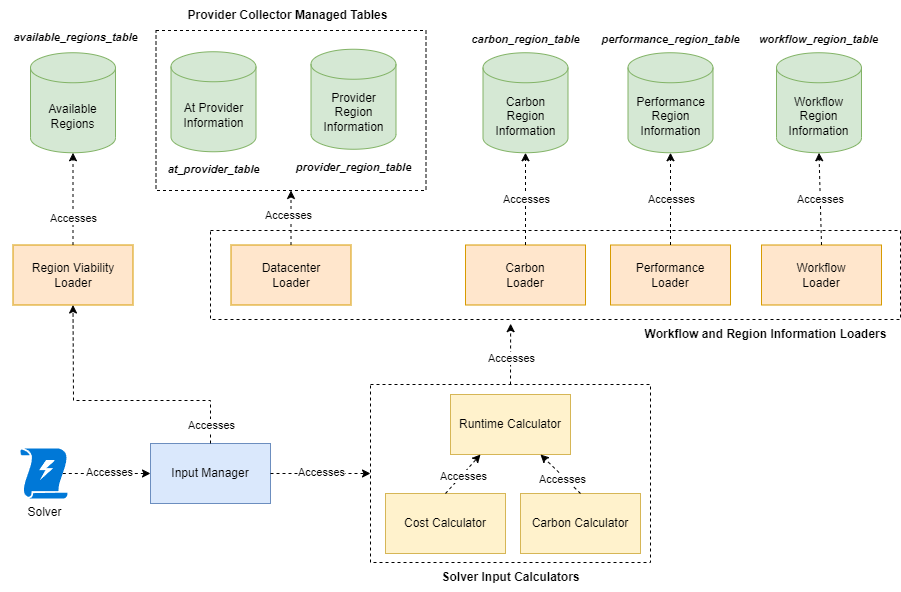

# Metrics Manager

The Metrics Manager is responsible for maintaining the data required for metrics modeling.
It consists of a Data Collector side and of a Deployment Solver Input side.

##  Data Collector

The Data Collectors are responsible for aggregating information needed by various instances of Solvers to solve for the optimal cost, carbon, and/or runtime.
This information is gathered through various different sources and both internal and external APIs.
This section will outline the various Data Collectors, their responsibilities, and also the format of their outputs.


There are four main types of data collectors, each accessing different sources of input data, managing their own output databases, and running or triggering at different intervals and/or trigger conditions.
The four main collectors are the Provider Collector, Carbon Collector, Performance Collector, and Workflow Collector.

All the following tables are stored in a DynamoDB database.
In the following, we will outline the responsibilities of each Data Collector, the database tables they manage, and the information stored in each table.
The information stored in each table has one key and one or more values.
All keys are strings.
The type of the key and values are denoted by the following abbreviations:

- S: String
- N: Number

If a string type is used but it has multiple child values, the string is a JSON string.

### Provider Collector

The Provider Collector is responsible for collecting information through external APIs regarding the cost, location, and offered services of all available data center regions, as well as identifying which data center regions are currently available.
This collector is pivotal for determining the availability of data centers, and it must be run at least once before the other data collectors can be functional, as it sets data center regions to be put under consideration.
Since pricing information and offered services of data center regions rarely change, this Collector should be run very infrequently, likely once per week or longer.
The frequency with which this collector should run needs further investigation.

This collector is responsible for managing the three database tables: `available_regions_table`, `at_provider_table`, and `provider_region_table`.

#### Available Regions Table

The `available_regions_table` is responsible for managing the list of available regions that may be viable for consideration by Solver instances and denotes which regions must be updated by the other Collectors.
This table is primarily responsible for listing the basic information of regions needed for the other Data Collectors, as well as the timestamp of when the region was last updated by each Data Collector (with the exception of the Workflow Data Collector, as that is Workflow-specific).
The Provider Collector must not override the timestamp of other Data Collectors.
The keys and information stored in this table are as follows:

- Key: `<provider_unique_id>:<region_name>`
- Value (S):
  - Available services at the data center region.
  - The geographical location of the data center region (in longitude and latitude).
- Provider Collector timestamp (N):
  - Timestamp of when the Provider Collector was last run for this data center region.
- Carbon Collector timestamp (N):
  - Timestamp of when the Carbon Collector was last run for this data center region.
- Performance Collector timestamp (N):
  - Timestamp of when the Performance Collector was last run for this data center region.

##### Available Regions Table Example

The example will be one item in the available regions table with all its keys:

```json
{
  "key": "aws:eu-south-1",
  "provider_collector": 1620000000,
  "carbon_collector": 1620000000,
  "performance_collector": 1620000000,
  "value": {
    "name": "Europe (Milan)",
    "provider": "aws",
    "code": "eu-south-1",
    "latitude": 45.4642035,
    "longitude": 9.189982
  }
}
```

#### Provider Table

The `provider_table` is responsible for managing information regarding provider-level information. The keys and information stored in this table are as follows:

- Key: `<provider_unique_id>`
- Value (S):
  - Remaining free tier at provider (invocation/execution).

##### Provider Table Example

The example will be one item in the at provider table with all its keys:

```json
{
  "key": "aws",
  "value": {}
}
```

#### Provider Region Table

The `provider_region_table` is responsible for managing region specific information.
The keys and information stored in this table are as follows:

- Key: `<provider_unique_id>:<region_name>`
- Value (S):
  - Execution Cost:
    - Values for each configuration (or services).
  - Power-efficiency-related information (PUE, CFE).
  - Average Memory and CPU compute power.
  - Transmission Cost:
    - Egress Global Data Transfer Cost (outgoing to different providers).
    - Egress Provider Data Transfer Cost (outgoing to different regions within the same provider).

Note: Data Transfer Cost and complexities of this warrant further investigation and thus associated storage information regarding such may be subject to change.

##### Provider Region Table Example

```json
{
  "execution_cost": {
    "invocation_cost": {
      "arm64": 2.3e-7,
      "x86_64": 2.3e-7,
      "free_tier_invocations": 1000000
    },
    "compute_cost": {
      "arm64": 1.56138e-5,
      "x86_64": 1.95172e-5,
      "free_tier_compute_gb_s": 400000
    },
    "unit": "USD"
  },
  "transmission_cost": {
    "global_data_transfer": 0.09,
    "provider_data_transfer": 0.02,
    "unit": "USD/GB"
  },
  "sns_cost": {
      "request_cost": 5e-07,
      "unit": "USD/requests"
  },
  "dynamodb_cost": {
      "read_request_cost": 2.5e-07,
      "write_request_cost": 1.25e-06,
      "storage_cost": 0.1,
      "unit": "USD"
  },
  "ecr_cost": {
      "storage_cost": 0.1,
      "unit": "USD"
  },
  "pue": 1.11,
  "cfe": 0.0,
  "average_memory_power": 3.725e-4,
  "max_cpu_power_kWh": 0.0035,
  "min_cpu_power_kWh": 0.00074,
  "available_architectures": ["arm64", "x86_64"]
}
```

### Carbon Collector

The Carbon Collector is responsible for calculating and refreshing carbon transmission and execution information for all available data center regions that are part of the `available_regions_table`, which was first populated by the Provider Collector.
Since carbon information changes frequently (where the Electric Maps API refreshes grid carbon information every hour), this collector may be run frequently, perhaps in the order of hours.
The frequency with which this collector should run needs further investigation.

This collector is responsible for managing the `carbon_region_table` database table.
It is also responsible for updating the timestamp of carbon-updated regions in the Carbon Collector timestamp field of the `available_regions_table` table.

#### Carbon Region Table

The `carbon_region_table` is responsible for managing carbon region-specific information. The keys and information stored in this table are as follows:

- Key: `<provider_unique_id>:<region_name>`
- Value (S):
  - Average Execution Carbon per kWh (gCO2e/kWh)
  - To Region `<provider_unique_id>:<region_name>`
    - Region-to-region Data Transfer Distance (km)

Note: Perhaps this may be expanded in the future if we are incorporating more execution or transmission carbon estimation techniques.

##### Carbon Region Table Example

```json
{
  "averages": {
      "overall": 10,
      "0": 10.0, "1": 10.0, "2": 10.0, "3": 10.0, "4": 10.0, "5": 10.0, "6": 10.0,
      "7": 10.0, "8": 10.0, "9": 10.0, "10": 10.0, "11": 10.0, "12": 10.0, "13": 10.0,
      "14": 10.0, "15": 10.0, "16": 10.0, "17": 10.0, "18": 10.0, "19": 10.0, "20": 10.0,
      "21": 10.0, "22": 10.0, "23": 10.0
  },
  "units": "gCO2eq/kWh",
  "transmission_distances": {"aws:region1": 0, "aws:region2": 111.19},
  "transmission_distances_unit": "km",
}
```

### Performance Collector

The Performance Collector is responsible for aggregating performance benchmarks to determine the relative performance differences of running workloads between different data center regions.
Similar to the Carbon Collector, this is only done for all available data center regions that are part of the `available_regions_table`, which was first populated by the Provider Collector.
Depending on the results of our investigation into the change in performance variability between data center regions and across providers, the frequency of this collector may need to be considered.
For now, this Collector should be run much more frequently than the Provider Collector but perhaps less frequently than the Carbon Collector.
Again, the frequency with which this collector should run needs further investigation.

This collector is responsible for managing the  `performance_region_table` database table.
It is also responsible for updating the timestamp of performance-updated regions in the Performance Collector timestamp field of the `available_regions_table` table.

#### Performance Region Table

The `performance_region_table` is responsible for managing performance region-specific information of our benchmarking application.
The keys and information stored in this table are as follows:

- Key: `<provider_unique_id>:<region_name>`
- Value (S):
  - Execution time of performance tests in various regions.
  - To Region `<provider_unique_id>:<region_name>`
    - Region-to-region Estimated latency in terms of data transfer size (s/GB).

Note: Perhaps in the future, we should also consider provider-level performance differences with a different database table.

##### Performance Region Table Example

```json
 {
    "relative_performance": 1,
    "transmission_latency": {
      "aws:region1": {"latency_distribution": [0.005, 0.007], "unit": "s"},
      "aws:region2": {"latency_distribution": [0.0055, 0.0057], "unit": "s"},
    },
},
```

### Workflow Collector

The Workflow Collector is responsible for aggregating runtime and invocation probability of each instance of one or more workflows and also includes the actual execution and transmission time of running workflow instances in a given region.
Similar to the Carbon and Performance Collector, it should only consider regions that are part of the `available_regions_table` and discard any information of workflow running in regions not in the available region list.
This Workflow Collector is different from the other collectors, as this Collector should not look at all workflows but perhaps for specific workflows that will soon need to have its deployment plan updated by the Solver.
This Collector should be run very frequently, and triggered by the Solver Update Checker.

This collector is responsible for managing the "workflow_instance_table" database table.
Unlike the other Data Collectors, the Workflow Collector should not and will not have or require updating any timestamp of the `available_regions_table` table.

#### Workflow Collector Input Table

The Workflow Collector is responsible for extracting information from the `workflow_summary_table`, which is managed by the Datastore Syncer. The Datastore Syncer should retrieve all the invocations log of the workflow from locally data centers and then remove the local entries only after finishing summarization.

##### Workflow Summary Table Example

Below is an example of the `workflow_summary_table` for the `image_processing` benchmark. All the runtime and latency are in units of seconds.

```json
{
  "daily_invocation_counts": { "2024-03-09+0000": 15 },
  "daily_user_code_failure_counts": { "2024-03-09+0000": 1 },
  "logs": [
  {
    "run_id": "e4d590c1fa594eb2a427a6f76cfbf290",
    "start_time": "2024-03-09 18:26:24,469750+0000",
    "runtime_s": 1.767225,
    "execution_data": [
        {
            "instance_name": "image_processing-0_0_1-get_requests:entry_point:0",
            "duration_s": 1.304223,
            "cpu_model": "Intel(R) Xeon(R) Processor @ 2.50GHz",
            "provider_region": "aws:us-east-1",
            "data_transfer_during_execution_gb": 8.391682058572769e-05,
            "cpu_utilization": 0.8477269608034823,
            "successor_data": {
                "image_processing-0_0_1-image_processor:image_processing-0_0_1-get_requests_0_4:5": {
                    "task_type": "INVOKE_SUCCESSOR_ONLY",
                    "invocation_time_from_function_start_s": 0.002343
                },
                "image_processing-0_0_1-image_processor:image_processing-0_0_1-get_requests_0_1:2": {
                    "task_type": "INVOKE_SUCCESSOR_ONLY",
                    "invocation_time_from_function_start_s": 0.00149
                },
                "image_processing-0_0_1-image_processor:image_processing-0_0_1-get_requests_0_0:1": {
                    "task_type": "INVOKE_SUCCESSOR_ONLY",
                    "invocation_time_from_function_start_s": 0.001229
                },
                "image_processing-0_0_1-image_processor:image_processing-0_0_1-get_requests_0_3:4": {
                    "task_type": "INVOKE_SUCCESSOR_ONLY",
                    "invocation_time_from_function_start_s": 0.002034
                },
                "image_processing-0_0_1-image_processor:image_processing-0_0_1-get_requests_0_2:3": {
                    "task_type": "INVOKE_SUCCESSOR_ONLY",
                    "invocation_time_from_function_start_s": 0.001763
                }
            },
            "additional_analysis_data": {
                "input_payload_size_gb": 6.7194923758506775e-06,
                "total_input_data_transfer_gb": 6.7194923758506775e-06,
                "total_output_data_transfer_gb": 3.308430314064026e-05
            }
        },
        {
            "instance_name": "image_processing-0_0_1-image_processor:image_processing-0_0_1-get_requests_0_4:5",
            "duration_s": 0.397,
            "cpu_model": "Intel(R) Xeon(R) Processor @ 2.50GHz",
            "provider_region": "aws:us-east-1",
            "data_transfer_during_execution_gb": 0.000269182026386261,
            "cpu_utilization": 0.30460386492443325,
            "additional_analysis_data": {
                "input_payload_size_gb": 6.617046892642975e-06,
                "total_input_data_transfer_gb": 6.617046892642975e-06,
                "total_output_data_transfer_gb": 0.0
            }
        },
        {
            "instance_name": "image_processing-0_0_1-image_processor:image_processing-0_0_1-get_requests_0_1:2",
            "duration_s": 0.409,
            "cpu_model": "Intel(R) Xeon(R) Processor @ 3.00GHz",
            "provider_region": "aws:us-east-1",
            "data_transfer_during_execution_gb": 0.0010230233892798424,
            "cpu_utilization": 0.295666832212714,
            "additional_analysis_data": {
                "input_payload_size_gb": 6.617046892642975e-06,
                "total_input_data_transfer_gb": 6.617046892642975e-06,
                "total_output_data_transfer_gb": 0.0
            }
        },
        {
            "instance_name": "image_processing-0_0_1-image_processor:image_processing-0_0_1-get_requests_0_0:1",
            "duration_s": 0.343,
            "cpu_model": "Intel(R) Xeon(R) Processor @ 2.50GHz",
            "provider_region": "aws:us-east-1",
            "data_transfer_during_execution_gb": 0.0010187756270170212,
            "cpu_utilization": 0.45329013301749266,
            "additional_analysis_data": {
                "input_payload_size_gb": 6.615184247493744e-06,
                "total_input_data_transfer_gb": 6.615184247493744e-06,
                "total_output_data_transfer_gb": 0.0
            }
        },
        {
            "instance_name": "image_processing-0_0_1-image_processor:image_processing-0_0_1-get_requests_0_3:4",
            "duration_s": 0.245,
            "cpu_model": "Intel(R) Xeon(R) Processor @ 2.50GHz",
            "provider_region": "aws:us-east-1",
            "data_transfer_during_execution_gb": 0.0007579168304800987,
            "cpu_utilization": 0.42307079081632654,
            "additional_analysis_data": {
                "input_payload_size_gb": 6.619840860366821e-06,
                "total_input_data_transfer_gb": 6.619840860366821e-06,
                "total_output_data_transfer_gb": 0.0
            }
        },
        {
            "instance_name": "image_processing-0_0_1-image_processor:image_processing-0_0_1-get_requests_0_2:3",
            "duration_s": 0.383,
            "cpu_model": "Intel(R) Xeon(R) Processor @ 2.50GHz",
            "provider_region": "aws:us-east-1",
            "data_transfer_during_execution_gb": 0.0008043637499213219,
            "cpu_utilization": 0.6314764197127938,
            "additional_analysis_data": {
                "input_payload_size_gb": 6.615184247493744e-06,
                "total_input_data_transfer_gb": 6.615184247493744e-06,
                "total_output_data_transfer_gb": 0.0
            }
        }
    ],
    "transmission_data": [
        {
            "transmission_size_gb": 6.617046892642975e-06,
            "transmission_latency_s": 1.205693,
            "from_instance": "image_processing-0_0_1-get_requests:entry_point:0",
            "to_instance": "image_processing-0_0_1-image_processor:image_processing-0_0_1-get_requests_0_4:5",
            "from_region": "aws:us-east-1",
            "to_region": "aws:us-east-1",
            "successor_invoked": true,
            "from_direct_successor": true
        },
        {
            "transmission_size_gb": 6.617046892642975e-06,
            "transmission_latency_s": 1.2693,
            "from_instance": "image_processing-0_0_1-get_requests:entry_point:0",
            "to_instance": "image_processing-0_0_1-image_processor:image_processing-0_0_1-get_requests_0_1:2",
            "from_region": "aws:us-east-1",
            "to_region": "aws:us-east-1",
            "successor_invoked": true,
            "from_direct_successor": true
        },
        {
            "transmission_size_gb": 6.615184247493744e-06,
            "transmission_latency_s": 1.367447,
            "from_instance": "image_processing-0_0_1-get_requests:entry_point:0",
            "to_instance": "image_processing-0_0_1-image_processor:image_processing-0_0_1-get_requests_0_0:1",
            "from_region": "aws:us-east-1",
            "to_region": "aws:us-east-1",
            "successor_invoked": true,
            "from_direct_successor": true
        },
        {
            "transmission_size_gb": 6.619840860366821e-06,
            "transmission_latency_s": 1.380402,
            "from_instance": "image_processing-0_0_1-get_requests:entry_point:0",
            "to_instance": "image_processing-0_0_1-image_processor:image_processing-0_0_1-get_requests_0_3:4",
            "from_region": "aws:us-east-1",
            "to_region": "aws:us-east-1",
            "successor_invoked": true,
            "from_direct_successor": true
        },
        {
            "transmission_size_gb": 6.615184247493744e-06,
            "transmission_latency_s": 1.384338,
            "from_instance": "image_processing-0_0_1-get_requests:entry_point:0",
            "to_instance": "image_processing-0_0_1-image_processor:image_processing-0_0_1-get_requests_0_2:3",
            "from_region": "aws:us-east-1",
            "to_region": "aws:us-east-1",
            "successor_invoked": true,
            "from_direct_successor": true
        }
    ],
    "start_hop_info": {
        "destination": "aws:us-east-1",
        "request_source": "Caribou CLI",
        "data_transfer_size_gb": 6.7194923758506775e-06,
        "latency_from_client_s": 0.614444,
        "time_from_function_start_to_entry_point_s": 0.000319,
        "workflow_placement_decision": {
            "data_size_gb": 6.22868537902832e-06,
            "consumed_read_capacity": 2.0,
            "retrieved_wpd_at_function": false
        }
    },
    "unique_cpu_models": [
        "Intel(R) Xeon(R) Processor @ 2.50GHz",
        "Intel(R) Xeon(R) Processor @ 3.00GHz"
    ]
  },
    ...
  ],
  "workflow_runtime_samples": [
    1.767225, ...
  ],
  "last_sync_time": "2024-03-09 18:52:40,671496+0000"
}
```

#### Workflow Collector Output Table

The `workflow_instance_table` is responsible for summarizing and collecting information regarding past instance invocation at various regions.

Below is an example of the `workflow_instance_table` output for a workflow with 2 instances. All the runtime and latency are in units of seconds.

```json
{
  "workflow_runtime_samples": [5.857085, 5.740116, 7.248474],
  "daily_invocation_counts": { "2024-03-12+0000": 3 },
  "daily_user_code_failure_counts": {},
  "start_hop_summary": {
    "invoked": 3,
    "retrieved_wpd_at_function": 0,
    "wpd_at_function_probability": 0.0,
    "workflow_placement_decision_size_gb": 6.22868537902832e-06,
    "at_redirector": {},
    "from_client": {
      "transfer_sizes_gb": [3.3527612686157227e-08, 3.3527612686157227e-08, 3.3527612686157227e-08],
      "received_region": {
        "aws:us-east-1": {
          "transfer_size_gb_to_transfer_latencies_s": {
              "3.3527612686157227e-08": [0.52388, 0.514119, 0.519146] 
          },
          "best_fit_line": {
            "slope_s": 0.0,
            "intercept_s": 0.51905,
            "min_latency_s": 0.363335,
            "max_latency_s": 0.674765,
          }
        }
      }
    }
  },
  "instance_summary": {
    "image_processing_light-0_0_1-GetInput:entry_point:0": {
      "invocations": 3,
      "cpu_utilization": 0.5906111443111876,
      "executions": {
        "at_region": {
          "aws:us-east-1": {
            "cpu_utilization": 0.6026562820042822,
            "durations_s": [
              1.140042781829834, 1.122507303237915, 1.1211644954681396
            ],
            "auxiliary_data": {
              "1.14": [
                  [5.103927105665207e-05, 0.002]
              ],
              "1.12": [
                  [7.103927105665207e-05, 0.004],
                  [3.103927105665207e-05, 0.003]
              ],
          }
        },
        "auxiliary_index_translation": {
          "data_transfer_during_execution_gb": 0,
          "image_processing_light-0_0_1-Flip:image_processing_light-0_0_1-GetInput_0_0:1": 1,
        }
      },
      "to_instance": {
        "image_processing_light-0_0_1-Flip:image_processing_light-0_0_1-GetInput_0_0:1": {
          "invoked": 3,
          "non_executions": 0,
          "invocation_probability": 1.0,
          "transfer_sizes": [2.9960647225379944e-06, 2.9960647225379944e-06],
          "regions_to_regions": {
            "aws:us-east-1": {
              "aws:us-east-1": {
                "transfer_size_gb_to_transfer_latencies_s": {
                  "2.9960647225379944e-06": [1.217899, 1.18531]
                },
                "best_fit_line": {
                  "slope_s": 0.0,
                  "intercept_s": 1.2016,
                  "min_latency_s": 0.84112,
                  "max_latency_s": 1.56208,
                }
              }
            }
          },
          "non_executions": 0,
          "invocation_probability": 1.0
        }
      }
    },
    "image_processing_light-0_0_1-Flip:image_processing_light-0_0_1-GetInput_0_0:1": {
      "invocations": 3,
      "cpu_utilization": 0.3496971243531307,
      "executions": {
        "at_region": {
          "aws:us-east-1": {
            "cpu_utilization": 0.6026562820042822,
            "durations_s": [
              4.631583183288574, 4.634178953170776, 6.073627948760986
            ],
            "auxiliary_data": {
              "4.63": [
                  [5.103927105665207e-05], [5.103927105665207e-05]
              ],
              "6.07": [
                  [7.103927105665207e-05]
              ],
          }
        },
        "auxiliary_index_translation": {
          "data_transfer_during_execution_gb": 0,
        },
      }
    }
  }
}
```

## Deployment Solver Input

Solver Input is a subcomponent of Deployment Solver responsible for providing input to the Solver.
It serves as an interface for the deployment algorithm instances to obtain execution and transmission data.
It accesses the necessary information from tables created and managed by the Data Collectors, including [`workflow_instance_table`](#workflow-collector-output-table), [`performance_region_table`](#performance-region-table), [`carbon_region_table`](#carbon-region-table), [`available_regions_table`](#available-regions-table), [`provider_region_table`](#provider-region-table), and [`provider_table`](#provider-table).

It consists of the `InputManager`, responsible for managing and setting up all appropriate loaders and calculators.
The Solver directly interacts with this component.
The data loaders include the `RegionViabilityLoader`, `DatacenterLoader`, `CarbonLoader`, `PerformanceLoader`, and `WorkflowLoader`.
Each is responsible for accessing one or more tables in a database, acquiring only the needed sets of data from each table to minimize database access cost.
The data calculators, including the "Runtime Calculator", "Cost Calculator", and "Carbon Calculator", are responsible for accessing data from the necessary data loaders and/or other calculators in order to calculate the execution and transmission cost/carbon/runtime.

Below is a diagram showing the overall access of data in the Solver Inputs:


